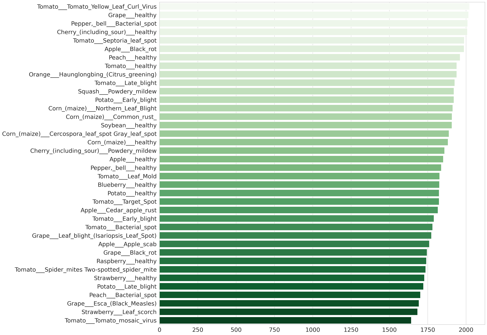
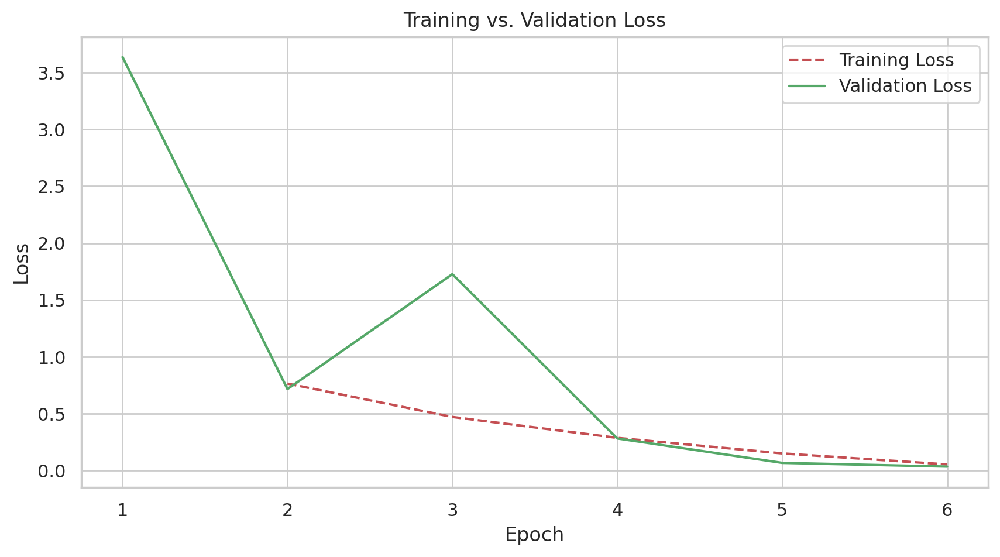
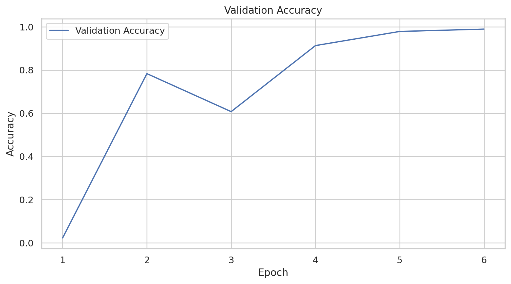
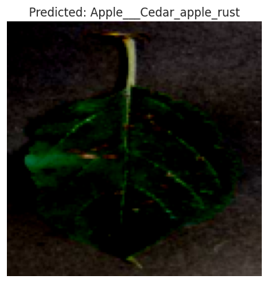

# Custom CNN-Based Plant Disease Detection: A Lightweight and Accurate Deep Learning Solution

##  1. Title & Abstract

### Title:
**Custom CNN-Based Plant Disease Detection: A Lightweight and Accurate Deep Learning Solution**

### Abstract:
Plant disease identification is a critical challenge in agriculture, especially in developing regions where expert diagnosis is not always accessible. In this study, we propose a lightweight Convolutional Neural Network (CNN) model tailored specifically for plant disease classification using leaf images.

The model was trained on a large, augmented dataset containing **over 70,000 images across 38 classes**, representing various diseases and healthy states. All images were resized to 128x128 and normalized. Our architecture features residual blocks, batch normalization, and adaptive average pooling for improved learning stability. The model was trained using **Adam optimizer**, **OneCycleLR scheduling**, and **cross-entropy loss** over **5 epochs** on a **GPU-enabled environment (Google Colab)**.

Experimental results show that the model reached a peak validation accuracy of **98.96%**, with validation loss converging steadily. The model also demonstrated strong generalization on an unseen test set. Our results suggest that a custom CNN can be as effective as larger transfer learning models while being computationally more efficient and interpretable.

This work provides a reproducible and practical solution that can be further optimized for real-time mobile deployment in smart agriculture systems.

---

##  2. Introduction

### Problem Definition:
Diseases in crops can cause massive economic and food production losses if not identified early. Manual diagnosis requires trained experts, which is impractical for large farms or rural areas. The goal from a machine learning standpoint is to build an image-based classification model that can distinguish between dozens of leaf conditions—including subtle differences between similar diseases—reliably and automatically.

### Motivation:
Automating plant disease detection using deep learning models allows scalable, fast, and accurate intervention. With high-resolution cameras available on mobile devices, farmers can potentially diagnose plant diseases in real-time. Such tools can reduce pesticide misuse and improve crop yield. A lightweight custom CNN also opens the door for deployment on resource-constrained devices.

### Gap in Literature:
Previous studies often relied on pre-trained transfer learning models (e.g., ResNet, Inception), which, while accurate, are resource-intensive and hard to interpret or adapt. Additionally, many works used smaller datasets or lacked robust evaluation across diverse diseases.

### Contributions:
- Development of a **custom CNN model** designed for 38 plant disease classes.
- Training on a **large augmented dataset** with minimal preprocessing.
- Use of **OneCycle learning rate policy** and **Adam optimizer** for fast convergence.
- High accuracy of **98.96%** within only 5 epochs.
- Demonstrated **generalization** to new images from a held-out test set.

---

##  3. Related Work

[1] Mohanty et al. (2016) used CNNs on the PlantVillage dataset, achieving high accuracy in lab conditions, but struggled in real-world environments.

[2] Ferentinos (2018) explored deeper CNNs and emphasized diverse datasets but relied heavily on computationally expensive architectures like AlexNet.

[3] Too et al. (2019) compared fine-tuned models (ResNet, DenseNet, etc.) with good results but also high hardware requirements.

In contrast, our approach:
- Uses a **custom-built CNN** optimized for plant leaf imagery.
- Avoids dependence on large pretrained models.
- Demonstrates high accuracy while remaining lightweight and interpretable.

---

##  4. Methodology

### Dataset
- **Source**: Kaggle dataset by vipoooool [4]
- **Total Images**: ~87,000 (Augmented version)
- **Used for Training**: ~70,295 images
- **Classes**: 38
- **Train/Validation Split**: 80% / 20%
- **Test Set**: 33 manually selected images
- **Image Size**: Resized to 128x128

**Sample Class Names:**
```
Tomato___Bacterial_spot
Grape___healthy
Apple___Apple_scab
Corn_(maize)___Common_rust_
Potato___Late_blight
... (total: 38 classes)
```

> 

**Figure 1:** Bar plot showing the number of images per disease class in the training dataset.

### Model Architecture
- **Conv2D layers** with BatchNorm + ReLU
- **Residual connections** for deep feature learning
- **MaxPooling** and AdaptiveAvgPooling
- **Fully connected layer** for classification (output: 38)

### Training Settings
| Parameter         | Value            |
|-------------------|------------------|
| Epochs            | 5                |
| Optimizer         | Adam             |
| Learning Rate     | 0.01             |
| Batch Size        | 16               |
| Scheduler         | OneCycleLR       |
| Loss Function     | CrossEntropy     |
| Hardware          | Google Colab GPU |

> 

**Figure 2:** Example grid of leaf images from different classes in the dataset.

---

## 5. Experiments & Results

### Training vs Validation Loss
> 

**Figure 3:** Training and validation loss across 5 epochs.

### Validation Accuracy Progress
> 

**Figure 4:** Validation accuracy trend during training.


**Epoch-wise Summary:**
| Epoch | Train Loss | Val Loss | Val Acc |
|-------|------------|----------|---------|
| 0     | 0.7647     | 0.7165   | 78.34%  |
| 1     | 0.4711     | 1.7273   | 60.75%  |
| 2     | 0.2871     | 0.2821   | 91.32%  |
| 3     | 0.1504     | 0.0671   | 97.87%  |
| 4     | 0.0537     | 0.0343   | **98.96%** |

### Test Set Predictions
> 

**Figure 5:** Model prediction on an unseen leaf image from the test set.

```text
Image 0: Predicted → Apple___Cedar_apple_rust
Image 5: Predicted → Apple___Apple_scab
Image 10: Predicted → Potato___Early_blight
Image 20: Predicted → Tomato___Early_blight
Image 30: Predicted → Tomato___Tomato_Yellow_Leaf_Curl_Virus
```

---

## 6. Discussion

- Model achieved high accuracy in only 5 epochs due to architectural efficiency.
- OneCycleLR contributed to fast convergence despite early instability.
- Residual connections improved feature learning without overfitting.
- Model generalized well to unseen test images.

### Limitations:
- Validation accuracy dipped in epoch 2 due to aggressive learning rate change.
- More real-world test samples are needed for better generalization claims.

### Future Enhancements:
- Integrate with smartphone apps or drones
- Model compression for real-time deployment
- Add Grad-CAM for interpretability
- Extend to multispectral or sensor data

---

## 7. Conclusion & Future Work

This paper proposed a custom CNN architecture for multi-class plant disease classification. The model showed exceptional performance with **98.96% validation accuracy** after just 5 epochs, highlighting its efficiency.

By using a well-balanced dataset, residual blocks, and efficient training techniques, the system provides a foundation for real-time plant disease monitoring.

### Future Work:
- Mobile and drone deployment
- Expansion to pest recognition
- Adding real-time feedback loop for field diagnosis

---

##  8. References

[1] P. Mohanty, D. P. Hughes, and M. Salathé, “Using Deep Learning for Image-Based Plant Disease Detection,” *Front. Plant Sci.*, vol. 7, p. 1419, Sep. 2016.

[2] K. P. Ferentinos, “Deep learning models for plant disease detection and diagnosis,” *Comput. Electron. Agric.*, vol. 145, pp. 311–318, Feb. 2018.

[3] J. Too, L. Yujian, S. Njuki, and L. Yingchun, “A comparative study of fine-tuning deep learning models for plant disease identification,” *Comput. Electron. Agric.*, vol. 161, pp. 272–279, Jun. 2019.

[4] Vipoooool, "New Plant Diseases Dataset", Kaggle, 2020. [Online]. Available: https://www.kaggle.com/datasets/vipoooool/new-plant-diseases-dataset. [Accessed: Jul. 22, 2025].

[5] X. He et al., “A systematic review of deep learning techniques for plant disease detection: classification, detection, and segmentation perspectives,” *Artif. Intell. Rev.*, vol. 2024, pp. 1–30, 2024.

[6] J. Lu, L. Tan, and H. Jiang, “Review on Convolutional Neural Network (CNN) applied to plant leaf disease classification,” *Agriculture*, vol. 11, no. 8, p. 707, 2021.

[7] B. Sunil et al., “Systematic study on deep learning-based plant disease detection or classification,” *Artif. Intell. Rev.*, vol. 56, pp. 14955–15052, 2023.

[8] C. İ. Sofuoğlu and D. Birant, “Potato plant leaf disease detection using deep learning,” *J. Agric. Sci.*, vol. 30, no. 1, pp. 153–165, 2024.

[9] M. S. A. Hassan et al., “A Deep Learning Based Model for Plant Disease Detection,” *J. Neonatal Surg.*, vol. 3655, 2025.

[10] X. Y. Zhang et al., “Review of the State of the Art of Deep Learning for Plant Diseases,” *Sensors*, vol. 25, no. 2, p. 472, 2025.

[11] S. J. Liu and X. Wang, “Plant diseases and pests detection based on deep learning: a review,” *Plant Methods*, vol. 17, art. 22, 2021.

[12] R. K. Enhancements, “AI-driven smart agriculture using hybrid transformer-CNN for robust disease detection,” *Sci. Rep.*, 2025.

---

**Thank You Message:**
Dear Students,

Thank you for exploring this plant disease detection model. It was built not just to classify leaves, but to inspire your journey in deep learning. Study every block, experiment with improvements, and let curiosity be your best mentor.

*"You don’t learn to code by copying, you learn to code by understanding, breaking, and rebuilding."*

Wishing you the best in your learning journey,  
**Abdulrahman Hamdi**
